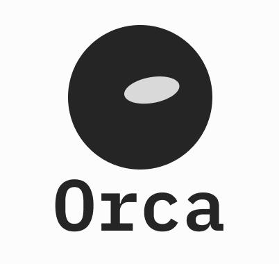
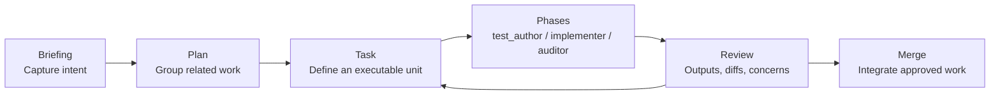

# Orca

<p align="center">
  
</p>

<p align="center">
  <strong>A desktop control plane for turning software work into briefed, planned, implemented, audited tasks.</strong>
</p>

<p align="center">
  <a href="https://github.com/andrewmcoupe/orca/actions/workflows/ci.yml"></a>
  <a href="https://github.com/andrewmcoupe/orca/releases"></a>
  <a href="LICENSE"></a>
  
  
</p>

<!-- Add the hero asset here when ready:
<p align="center">
  
</p>
-->

Orca is a local-first desktop app for managing AI-assisted software delivery. It helps you capture a brief, shape it into a plan, run task phases through CLI providers, inspect outputs and diffs, and merge only once the work has passed review.

> [!NOTE]
> Orca is an active early-stage project. The app is useful today, but APIs, workflows, and release packaging may still change between versions.

## Why Orca

Modern agentic coding workflows create a coordination problem: the work is fast, but the surrounding context, review trail, diff ownership, and release confidence can become scattered. Orca gives that workflow a dedicated desktop surface instead of leaving it spread across terminal scrollback, notes, branches, and ad-hoc prompts.

| Problem | Orca's approach |
| --- | --- |
| Vague feature intent | Turn rough input into a structured briefing and plan. |
| Agent work without boundaries | Run explicit task phases with provider, model, and permission settings. |
| Hard-to-review output | Keep phase output, event history, diffs, and auditor verdicts attached to the task. |
| Risky merges | Review file overlap, worktree state, and audit results before merge. |
| Lost workflow context | Store workspace state and task history locally in SQLite-backed projections. |

## How It Works



## Features

| Area | What you get |
| --- | --- |
| Workspaces | Register repositories, configure defaults, and keep project state isolated. |
| Briefings | Generate and refine structured plans from high-level project intent. |
| Plans | Track grouped work, dependencies, status, and lifecycle decisions. |
| Tasks | Run task-specific implementation flows with relevant files and dependency awareness. |
| Phase runs | Execute provider-backed phases for test authoring, implementation, and audit. |
| Providers | Integrations for CLI-based coding providers, including Codex and Claude. |
| Review | Inspect phase output, diffs, unchanged concerns, auditor verdicts, and merge readiness. |
| Events | Maintain a workspace event trail for projections, debugging, and workflow history. |

## Screenshot

<!-- Replace this section with the final screenshot when ready.

<picture>
  <source media="(prefers-color-scheme: dark)" srcset="docs/assets/screenshot-dark.png">
  <source media="(prefers-color-scheme: light)" srcset="docs/assets/screenshot-light.png">
  
</picture>

-->

Screenshot coming soon.

## Quick Start

### Prerequisites

| Dependency | Version |
| --- | --- |
| Node | 20+ |
| pnpm | 9+ |
| Rust | stable |
| Tauri system dependencies | Platform-specific |

### Platform Dependencies

**macOS**

```bash
xcode-select --install
```

**Linux (Ubuntu/Debian)**

```bash
sudo apt update && sudo apt install -y \
  libwebkit2gtk-4.1-dev libayatana-appindicator3-dev librsvg2-dev \
  patchelf libssl-dev build-essential curl wget file libxdo-dev
```

**Windows**

Install Microsoft Edge WebView2 and Visual Studio Build Tools with the "Desktop development with C++" workload. WebView2 is preinstalled on Windows 11.

### Run Locally

```bash
pnpm install
pnpm tauri dev
```

The first Tauri run compiles the Rust backend from scratch. Subsequent runs are incremental.

## Scripts

| Command | Purpose |
| --- | --- |
| `pnpm tauri dev` | Launch the desktop app with Vite and Tauri hot reload. |
| `pnpm dev` | Run the frontend in a browser. Most features require Tauri IPC. |
| `pnpm build` | Typecheck and build the frontend bundle. |
| `pnpm tauri build` | Produce a release-mode desktop bundle. |

## Development Checks

Run the same checks CI runs before opening a pull request.

```bash
pnpm build
cd src-tauri
cargo fmt --all -- --check
cargo clippy --all-targets --all-features -- -D warnings
cargo test --all-features --no-fail-fast
```

Useful Rust commands from `src-tauri/`:

| Command | Purpose |
| --- | --- |
| `cargo test` | Run Rust tests. |
| `cargo check` | Fast type-check without producing binaries. |
| `cargo fmt --all` | Format the Rust workspace in place. |
| `cargo fmt --all -- --check` | Verify Rust formatting without writing changes. |
| `cargo clippy --all-targets --all-features -- -D warnings` | Run lint checks with warnings treated as errors. |

## Architecture Notes

Orca is built as a Tauri 2 desktop app:

| Layer | Stack |
| --- | --- |
| Desktop shell | Tauri 2 |
| Frontend | React 19, TypeScript, Vite, TanStack Router, TanStack Query |
| Backend | Rust, SQLite, event projections, subprocess orchestration |
| Styling | Tailwind CSS 4 with local UI primitives |

The backend keeps workspace registration in the app database and workspace-specific event state in each repository. See [docs/events.md](docs/events.md) for the event model and projection details.

## Releasing

Releases are built and signed by GitHub Actions on tag push. The workflow creates a draft GitHub release with signed macOS `.dmg` assets and Tauri updater artifacts.

<details>
<summary>Release checklist</summary>

1. Bump the version in all three places. The tag is the version with a leading `v`.

   - `package.json` -> `"version": "0.1.5"`
   - `src-tauri/Cargo.toml` -> `version = "0.1.5"`
   - `src-tauri/tauri.conf.json` -> `"version": "0.1.5"`

   The Tauri updater compares the running app version against the version in `latest.json`, which comes from `tauri.conf.json`.

2. Commit and push to `main`.

   ```bash
   git commit -am "release: v0.1.5"
   git push origin main
   ```

3. Tag and push the tag. This triggers the release workflow.

   ```bash
   git tag v0.1.5
   git push origin v0.1.5
   ```

4. Wait for the workflow to finish in GitHub Actions.

5. Review the draft release and confirm the expected assets are present:

   - `orca_<version>_aarch64.dmg`
   - `orca_<version>_x64.dmg`
   - `orca.app.tar.gz`
   - `orca.app.tar.gz.sig`
   - `latest.json`

6. Edit the release notes in the description field, then publish the release.

</details>

<details>
<summary>Release troubleshooting</summary>

- Signing or notarization failed: check the `tauri-action` output and the Apple signing secrets in `.github/workflows/release.yml`.
- Auto-update is not picking up the release: confirm `src-tauri/tauri.conf.json` matches the tag and the GitHub release is published rather than draft.
- A published release needs to be pulled: unpublish it before anyone updates, or ship a fix-forward release with a higher version.

</details>

### Local Bundle Smoke Test

```bash
pnpm tauri build
```

This produces an unsigned local `.dmg` in `src-tauri/target/release/bundle/dmg/`.

## Community

| Resource | Link |
| --- | --- |
| Contributing | [CONTRIBUTING.md](CONTRIBUTING.md) |
| Code of conduct | [CODE_OF_CONDUCT.md](CODE_OF_CONDUCT.md) |
| Security | [SECURITY.md](SECURITY.md) |
| Support | [SUPPORT.md](SUPPORT.md) |
| License | [MIT](LICENSE) |
